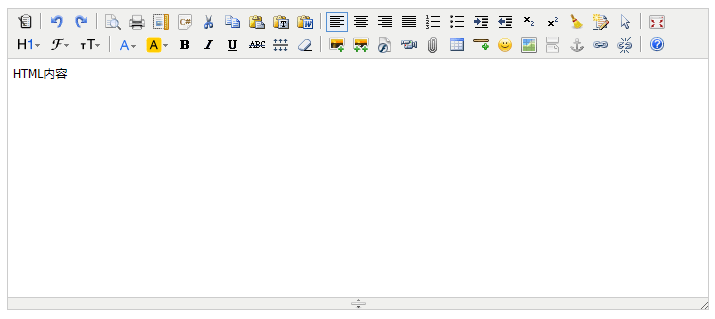

Laravel5-KindEditor
---------
Laravel5-KindEditor 是基于 KindEditor 封装的 Markdown 在线HTMl编辑器，支持 Laravel5 项目。已集成本地、七牛云、阿里云文件存储。

## 更新记录

* 2018-06-15 `Release v1.0.0` 完成 KindEditor 在线编辑器主程序，且集成本地、七牛、阿里云oss存储。

## 安装流程

1、安装的两种方式

① 直接编辑配置文件

将以下内容增加到 composer.json：

```json
require: {
    "chenhua/laravel5-kindeditor": "~1.0"
}
```

然后运行 `composer update`。

② 执行命令安装

运行命令：

```bash
composer require chenhua/laravel5-kindeditor
```

2、完成上面的操作后，修改 `config/app.php` 中 `providers` 数组

```php
Chenhua\Kindeditor\KindeditorServiceProvider::class,
```

3、执行 `artisan` 命令，生成 `config/kindeditor.php` 配置文件

```bash
php artisan vendor:publish --tag=kindeditor
```

4、修改 `config/kindeditor.php` 配置文件

```bash
<?php
return [
    "default"     => 'local', //默认返回存储位置url
    "dirver"      => ['local'], //存储平台 ['local', 'qiniu', 'aliyun']
    "connections" => [
        "local"  => [
            'prefix' => 'uploads/kindeditor', //本地存储位置，默认uploads
        ],
        "qiniu"  => [
            'access_key' => '',
            'secret_key' => '',
            'bucket'     => '',
            'prefix'     => '', //文件前缀 file/of/path
            'domain'     => '' //七牛自定义域名
        ],
        "aliyun" => [
            'ak_id'     => '',
            'ak_secret' => '',
            'end_point'  => '',
            'bucket'    => '',
            'prefix'    => '',
        ],
    ],
];
```
> 七牛和阿里云的配置内容，需要去对应官网申请账号并配置获取，此处省略一万字。。。

## 使用方法

### 在 `xxx.blade.php` 编辑器相应位置添加如下代码：

```html
<textarea id="editor_id" name="content" style="width:700px;height:300px;">
    HTML内容
</textarea>

@include('kindeditor::editor',['editor'=>'editor_id'])
```
> 以上操作能生成一个 `id="editor"` 的 `HTML` 文本编辑框，并能实时预览效果.

更多用法可以参考 `KindEditor` 官方文档，[解锁更多姿势>>>](http://kindeditor.net/doc.php)

### 效果展示

default样式：


## License
本扩展遵循 [MIT license](http://opensource.org/licenses/MIT) 开源。


